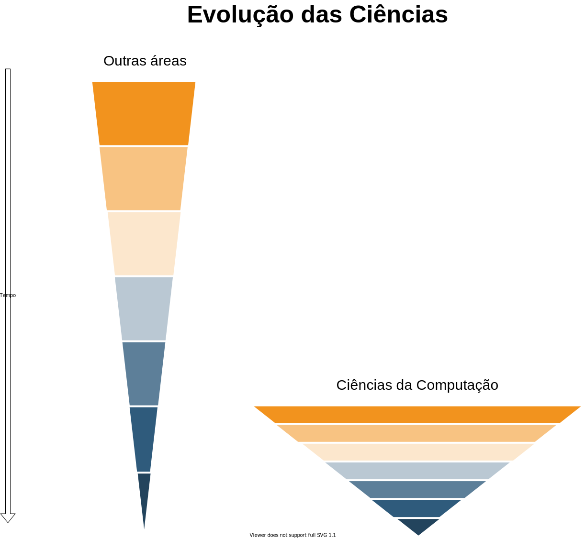

# Algumas anotações das aulas

## 

## Aula: 02

Piadinha Nerd .. "O **hardware** é o que chutamos e **software** o que xingamos".  

## Unidade 2 - História da Computação e do Computador

Como aquecimento para nossa atividade de conhecer um pouco a história da Computação e do Computador, vamos ler alguns trechos do livro HISTÓRIA DA COMPUTAÇÃO: O CAMINHO DO PENSAMENTO E DA TECNOLOGIA, de Cléuzio Fonseca Filho (Porto Alegre: EDIPUCRS, 2007).  

Ninguém produz por si mesmo os conhecimentos de que necessita para sobreviver em meio à sociedade na qual nasce; a grande maioria **dos conhecimentos** chega como algo adquirido, que se recebe pela interação com o meio ambiente. Desde o instante em que o homem se dá conta do mundo e de si mesmo, percebe-se rodeado de  instituições e tradições que vive e atualiza de um modo natural, sem se dar conta de que foi forjado nesse entorno, com atitudes e pontos de vista tão arraigados em seu modo de ser, em sua psicologia, que nada lhe parece estranho ou desconhecido. Somente quando o homem sai do seu entorno vital e entra em contato com novas superfícies de valores, tradições, costumes, é que começa a compará-los com os seus e a se perguntar reflexivamente sobre tais coisas, pelas verdades de umas e outras.  
A história é parte dessa necessidade humana de refletir: é o desejo de explicar a origem e a verdade das próprias instituições, quem ou qual acontecimento as estabeleceu. (p.16)  

A computação é um corpo de conhecimentos formado por uma infra-estrutura conceitual e um edifício tecnológico onde se materializam o hardware e o software. A primeira fundamenta a segunda e a precedeu. A teoria da computação tem seu desenvolvimento próprio e independente, em boa parte, da tecnologia. Essa teoria baseia-se na definição e construção de máquinas abstratas, e no estudo do poder dessas máquinas na solução de problemas. A preocupação constante de minimizar o esforço repetitivo e tedioso produziu o desenvolvimento de máquinas que passaram a substituir os homens em determinadas tarefas. Entre essas está o computador, que se expandiu e preencheu rapidamente os espaços modernos pelos quais circulam as pessoas. A partir do aparecimento da noção de número natural, passando pela notação aritmética e pela notação mais vinculada ao cálculo algébrico, mostra-se como apareceram regras fixas que permitiram computar com rapidez e precisão, poupando, como dizia Leibniz, o espírito e a imaginação. “Descartes acreditava no emprego sistemático do cálculo algébrico como um método poderoso e universal para resolver todos os problemas. Esta crença juntou-se à de outros e surgem as primeiras idéias sobre máquinas universais, capazes de resolver todos os problemas. Esta era uma crença de mentes poderosas que deixaram obras respeitáveis na Matemática e nas ciências em geral” (p.13)  

Comparada com outras áreas, a Ciência da Computação é muito recente. Mas, nestes poucos anos (pode-se apontar a Segunda Guerra Mundial como um marco inicial, quando efetivamente se construíram os primeiros computadores digitais) o avanço da Computação foi exponencial, abrindo-se em um grande leque de tecnologias, conceitos, idéias, transformando-se em uma figura quase irreconhecível. Atualmente falar de estado da arte na Computação tornou-se sem sentido: sob que ótica, perspectiva, campo ou área? Apesar da sua recente irrupção na história contemporânea, a partir dos anos 40 do século XX, ela já se tornou complexa, ampla, geradora de novos enfoques, tornando-se um verdadeiro desafio a quem queira entendê-la e traçar sua evolução. (p.23)  

Vamos trocar umas ideias a respeito?  
